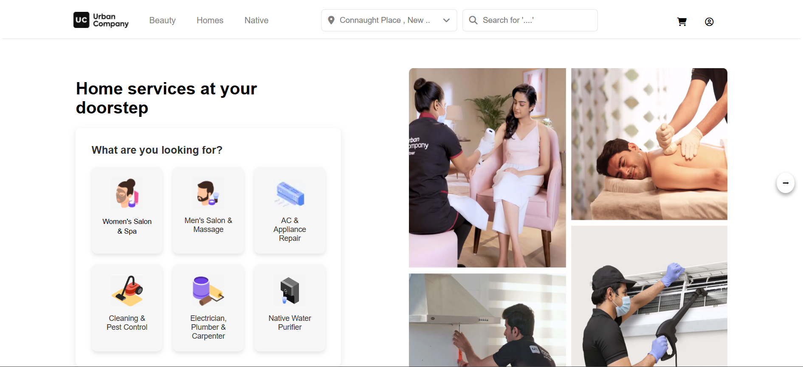
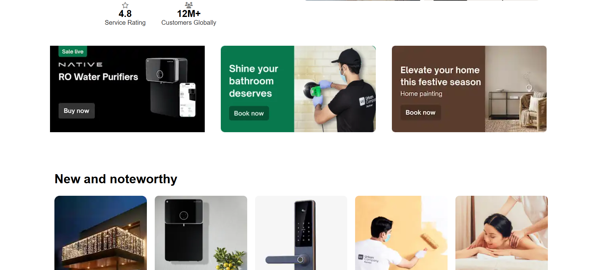
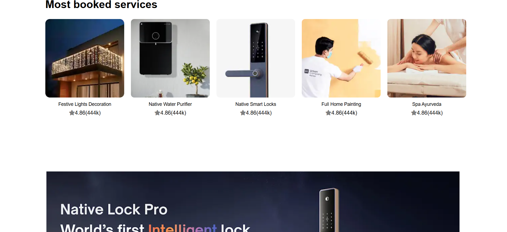
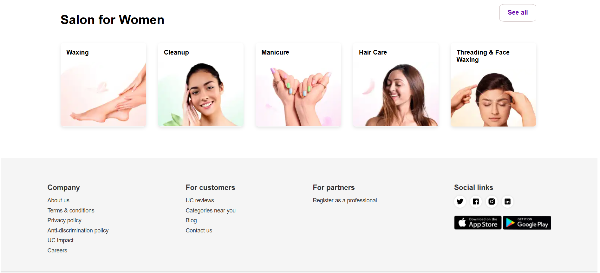

<h1 align= "center"> Urban Company Clone Website</h1>

- This is an Urban Company clone website 
- Building this with intention of learning HTML, CSS.

---
## 📸 Screenshots

<table border="1">
  <thead>
    <tr>
      <th style="text-align:center;" >1</th>
      <th style="text-align:center;" >2</th>
    </tr>
  </thead>
  <tbody>
    <tr>
      <td></img></td>
      <td></img></td>
    </tr>
  </tbody>
</table>

<table border="1">
  <thead>
    <tr>
      <th style="text-align:center;" >3</th>
      <th style="text-align:center;" >4</th>
    </tr>
  </thead>
  <tbody>
    <tr>
      <td></img></td>
      <td></img></td>
    </tr>
  </tbody>
</table>

 

**Orignal Wesite**
[Link](https://www.urbancompany.com/delhi-ncr)

<h4>The original website’s UI may evolve over time, so this clone reflects its design at the time of development.</h4>
